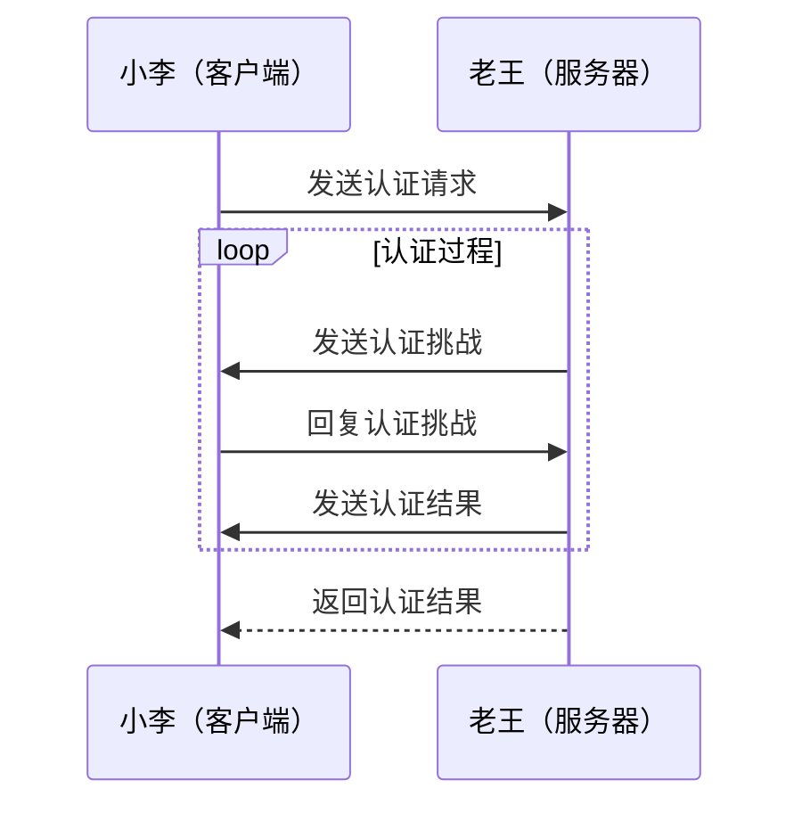

在软件开发中会遇到很多认证和授权的情况，如果深究起来，到底是怎么回事呢？说白了就两个事：

1. 作为客户端，我怎么证明我有权限访问目标资源？
2. 作为服务端，我凭什么信任你可以访问我的资源？

如果要拆开去理解认证（Authentication）和授权（Authorization），用大白话可以这样理解：

1. 认证（Authentication）是为了证明你的身份，带来的结果就是我确定你就是你。
2. 授权（Authorization）是为了权限细分，你到底有啥权限，能干什么勾当。

逻辑上讲，授权可以包含认证，但为了更好的解耦和扩展，一般认证和授权还是分开处理，先认证，后授权。

## 认证的抽象

用一个图可以很容易理解认证，你去敲门，老王一看是你呀小李，认证完毕。

## 授权的抽象

## 认证的方式

## 授权的方式

## 小结
